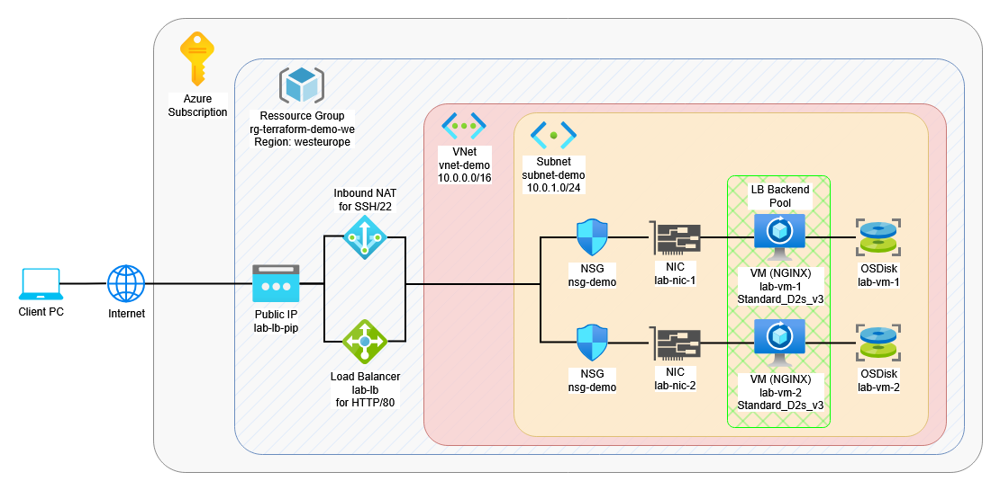

# Azure Infrastructure with Terraform

This project deploys a small Azure infrastructure using Terraform.

## Components

- Resource Group
- Virtual Network
- Subnet
- Network Security Group with SSH rule
- Public IP
- Network Interface
- Linux Virtual Machine with NGINX Web Server
- Public Load Balancer
- Inbound NAT

## Goal

The goal of this project is to practice:

- Azure infrastructure basics
- Infrastructure as Code (IaC)
- Terraform workflow
- Network and security fundamentals
- VM deployment and SSH access
- Create load balanced webservers

## Architecture

The deployment creates:

- one resource group in Azure
- one virtual network with one subnet
- one network security group allowing SSH (TCP/22) and HTTP (TCP/80)
- one public IP and network interface
- two Ubuntu Linux VM
- one public load balancer
- one inbound NAT



## Files

- `provider.tf` - provider configuration
- `main.tf` - resource group
- `network.tf` - virtual network and subnet
- `security.tf` - NSG and SSH rule
- `compute.tf` - public IP, NIC and VM
- `variables.tf` - variable definitions
- `terraform.tfvars` - environment-specific values
- `outputs.tf` - Terraform outputs
- `loadbalancer.tf` - loadbalancer, healthprobe and NAT

## Requirements

- Terraform
- Azure CLI
- Azure subscription
- SSH key pair

## Usage

Initialize Terraform:

```bash
terraform init
```
Validate configuration:
```bash
terraform validate
```
Preview changes:
```bash
terraform plan
```
Deploy infrastructure:
```bash
terraform apply
```
Destroy infrastructure after testing:
```bash
terraform destroy
```
Get public VM IP:
```bash
terraform output
```
Generate SSH key for SSH connection
```bash
ssh-keygen -t rsa -b 4096 -f "PATH/azure_tf_key"
```
Powershell SSH connection to the VM
```bash
ssh -i "PATH/azure_tf_key" azureuser@PUBLICIP
```
Key Path must be added to the .tfvars file - *ssh_public_key_path*

## Notes

The VM size used in this project is Standard_D2s_v3.
Costs can occur while resources are running.
Always destroy resources after testing to avoid unnecessary charges.

## Learning Outcome

With this project I practiced deploying Azure infrastructure with Terraform, including networking, security, compute resources and SSH connectivity.